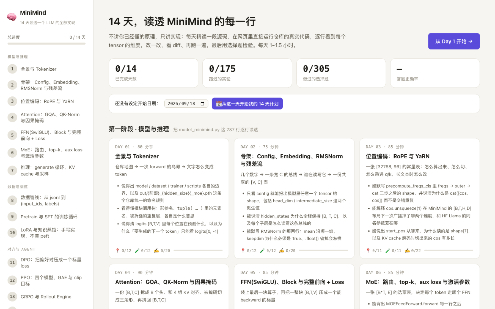
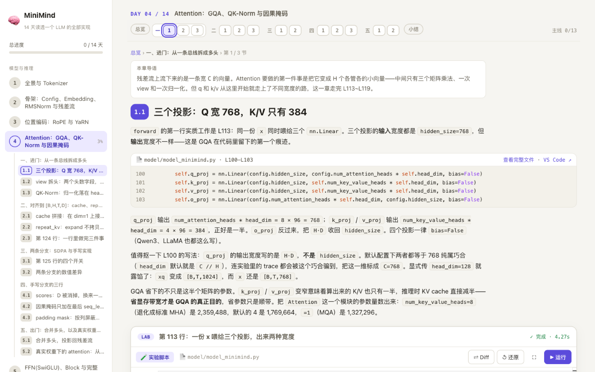
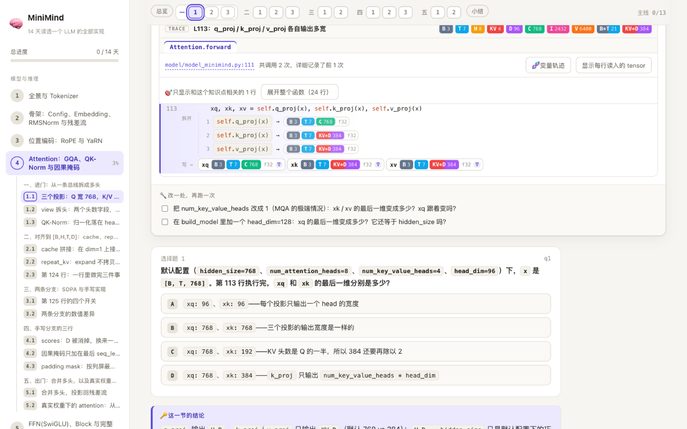
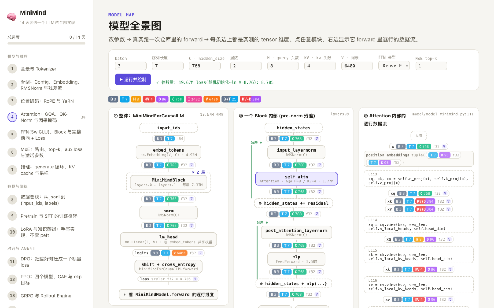

# learn-llm-14days

中文 | [English](README_en.md)

**14 天，把一个 LLM 的全部实现读透。**

一个跑在你自己电脑上的交互式学习站：以 [MiniMind](https://github.com/jingyaogong/minimind)（一亿参数、能在笔记本上从零训练的中文小模型）为教材，
每天精读一段**真实源码** → 在浏览器里直接运行它 → **逐行看到每个 tensor 的 shape** → 改一处再跑 → 做几道题。
从 tokenizer 到 Attention / MoE / KV cache，再到 Pretrain / SFT / LoRA / DPO / PPO / GRPO / Agent RL，14 天走完一个现代 LLM 的模型与训练全链路。

不需要 GPU。所有实验在 Mac（Apple Silicon）或普通 CPU 上几秒到一两分钟内跑完。



## 适合谁

- Python 熟练，听过 attention、RoPE、MoE、DPO 这些词，但**没有亲手写过（或完整读过）一个 LLM 的实现**
- 想知道「论文里的那个公式，落到代码里到底是哪几行、shape 怎么一步步变」
- 想弄清楚训练管线里 `input_ids / labels / loss_mask` 是怎么拼出来的，DPO / PPO / GRPO 的 loss 到底差在哪几行

不适合：想学原理科普的（这里默认你知道 softmax 是什么）；想训练一个能用的模型的（请去上游 MiniMind）。

## 为什么用 MiniMind 当教材

- 整个模型定义 [`minimind/model/model_minimind.py`](minimind/model/model_minimind.py) 只有 **288 行**，却是完整的现代架构：RMSNorm、RoPE + YaRN、GQA、QK-Norm、SwiGLU、MoE、KV cache、tied embeddings。
- 训练全链路都在同一个仓库里，每个阶段一两百行：Pretrain → SFT → LoRA / 蒸馏 → DPO / PPO / GRPO → Agent RL。
- 官方权重只有 1 亿参数（fp32 130MB），CPU 上做一次 forward 不到一秒，所以每个知识点都能**真跑**而不是看图。

## 14 天学什么

| 天 | 主题 | 小节 | 实验 | 题 |
|---|---|---|---|---|
| **第一阶段 · 模型与推理**：把 `model_minimind.py` 这 288 行逐行读透 | | | | |
| Day 1 | 全景与 Tokenizer | 12 | 12 | 20 |
| Day 2 | 骨架：Config、Embedding、RMSNorm 与残差流 | 12 | 12 | 20 |
| Day 3 | 位置编码：RoPE 与 YaRN | 11 | 11 | 22 |
| Day 4 | Attention：GQA、QK-Norm 与因果掩码 | 13 | 13 | 21 |
| Day 5 | FFN(SwiGLU)、Block 与完整前向 + Loss | 12 | 12 | 19 |
| Day 6 | MoE：路由、top-k、aux loss 与激活参数 | 13 | 13 | 23 |
| Day 7 | 推理：generate 循环、KV cache 与采样 | 13 | 13 | 22 |
| **第二阶段 · 数据与训练**：从 jsonl 到 loss 下降 | | | | |
| Day 8 | 数据管线：从 jsonl 到 (input_ids, labels) | 12 | 12 | 22 |
| Day 9 | Pretrain 与 SFT 的训练循环 | 13 | 13 | 22 |
| Day 10 | LoRA 与知识蒸馏：手写实现，不套 peft | 13 | 13 | 21 |
| **第三阶段 · 对齐与 Agent** | | | | |
| Day 11 | DPO：把偏好对压成一个标量 loss | 13 | 12 | 23 |
| Day 12 | PPO：四个模型、GAE 与 clip 目标 | 13 | 13 | 21 |
| Day 13 | GRPO 与 Rollout Engine | 12 | 12 | 21 |
| Day 14 | Agent RL、部署与总复习 | 14 | 14 | 28 |

共 62 章、176 个小节、175 个可运行实验、305 道题；每天 75~95 分钟。完整大纲见 [PLAN.md](PLAN.md)。

## 每一天是怎么上的

像上课一样：**先给全景，再按主题分章，每个小节只讲一个点，先讲清楚，再动手。**

- **总览**（进来第一屏）：今天这段代码在整个模型里的位置（一条数据流，今天的主角高亮）、分哪几章、学完能做到什么。
- **章**：提炼过的主题（如「模型的配置：MiniMindConfig」）。**小节**：一屏一个点，陈述式标题（如「intermediate_size 的来历」）。
- 每个小节的节奏固定：
  1. **讲解**——这段代码做什么、为什么这么写、shape 怎么变、坑在哪，源码片段穿插其中；
  2. **▶ 动手验证**——只针对这个点的微实验，点一下就跑；
  3. **🔧 改一处再跑**——按提示改一行，变化了的 shape 会被高亮；
  4. **小测**——带完整解析的选择题；
  5. **🔑 一句话结论**。
- 少数反直觉的地方会「先猜，再跑」：选完不揭晓，实验跑完自动告诉你猜对没有。
- 不在主线上的细节折叠在「延伸」里；虚线框的是选学小节。最后一屏「今日小结」汇总每一节的结论，再来几道跨章综合题。
- 顶部进度轨按章分组，左侧是当天大纲，`←` `→` 翻页，每个小节有自己的链接。进度自动保存。



## 看 tensor 维度：这个站的核心

实验里的 `trace(...)` 会把函数**每一行写出了哪些 tensor、shape 是什么**标在源码下面：



- 色块 = 维度符号，全站同色：`B` batch · `T` 序列长度 · `H` query 头数 · `KV` kv 头数 · `D` head_dim · `C` hidden · `I` FFN 中间层 · `V` 词表 · `E` 专家数；`B*T`、`KV*D` 这类乘积用渐变色。`view / transpose / reshape` 前后维度怎么搬家，看颜色就知道。
- 一行里连着做好几步（`xq.view(...).transpose(1, 2)`）会被**拆开**成子表达式逐个标出 shape。
- 没被执行的行变暗（一眼看出走了哪个分支）；函数被调多次时用 `#1 #2 …` 切换；点任意色块弹出这个 tensor 的详情。
- **🧬 变量轨迹**：同一个变量的 shape 演变串成一行，如 `xq: [B,T,C] → [B,T,H,D] → [B,H,T,D]`。
- **🌲 模块调用树**：每个子模块一行「forward 的各个实参 → 返回值」，带参数量。
- 改了代码再跑，**shape 变了的 tensor 会被橙色框标出，并显示上一次的 shape**。

「📄 源码」标签页允许直接修改 `model_minimind.py` 等文件再跑——修改只对这一次运行生效（通过 `sys.modules` 覆盖实现），磁盘上的源码一个字都不会动，随时「↺ 还原」或看「⇄ Diff」。

除了每天的课，还有两个自由玩的页面：

- **🗺️ 模型全景图**：调 batch / 序列长度 / hidden / 层数 / 头数 / MoE，真跑一次 forward，整体 → Block → 模块内部三栏，每条边都是实测维度。
- **🧪 Playground**：自由写代码，`from learnkit import *` 就能用全部可视化工具。



## 快速开始

需要 Python 3.10+，约 2GB 磁盘（依赖 1GB + 权重和数据 0.8GB）。

```bash
git clone https://github.com/richardds5/learn-llm-14days.git
cd learn-llm-14days
python3 -m venv venv && venv/bin/pip install -r requirements.txt
venv/bin/python scripts/download.py     # 官方权重 ~660MB + 5 个数据文件 ~125MB
./start.sh                               # 打开 http://127.0.0.1:8877
```

- 国内下载慢：`venv/bin/python scripts/download.py --source modelscope`（需要 `pip install modelscope`），或先 `export HF_ENDPOINT=https://hf-mirror.com`。
- `venv/bin/python scripts/download.py --check` 看文件齐不齐。
- Windows：用 `venv\Scripts\python server.py` 代替 `./start.sh`（未充分测试，欢迎反馈）。
- 服务只监听 127.0.0.1。**它会执行网页发来的 python 代码**（这就是它存在的意义），不要把它暴露到公网。

在终端里也能跑任何一个实验（可视化退化成文本）：

```bash
venv/bin/python runner.py lessons/day04/labs/qkv_proj.py
```

## 目录结构

```
learn-llm-14days/
├── start.sh  server.py  runner.py   # 本地服务 + 在 minimind/ 上下文里执行实验的运行器
├── lib/learnkit/                    # tensor 追踪与可视化库（trace / show / heatmap / plot …），可单独在你自己的脚本里用
├── web/                             # 前端：原生 JS，无构建（Monaco / KaTeX / marked / highlight.js 走 CDN）
├── lessons/dayNN/                   # 每天一个目录：lesson.md（课文）+ quiz.json（题）+ labs/*.py（实验）
├── tools/check_lessons.py           # 课程体检：引用 / 行号 / 题目结构；--run 把 175 个实验全跑一遍
├── tools/make_plan.py  PLAN.md      # 从各天 frontmatter 生成总览
├── tools/briefs/  AUTHORING.md      # 课程编写规范 + 交给 AI 写课 / 盲审用的任务书
├── scripts/download.py              # 下载权重和数据
└── minimind/                        # 上游 MiniMind 的原样快照（钉在 commit a3c7b01，见下）
    ├── model/ trainer/ dataset/ scripts/ eval_llm.py
    ├── out/*.pth                    # 下载的权重（不进 git）
    └── dataset/*.jsonl              # 下载的数据（不进 git）
```

实验以 `minimind/` 为工作目录运行，所以课文里 `model/model_minimind.py:111` 这样的引用、实验里 `from model.model_minimind import ...` 都是相对它的。
你改过的实验代码保存在 `workspace/`，进度在 `progress.json`（删掉即重置）。

## 常见问题

**端口被占用 / `Address already in use`**：上次的服务还开着（可能在另一个终端标签页）。`lsof -i :8877` 找到它 `kill`，或换端口 `./start.sh --port 9000`。

**页面顶部出现黄色提示条「server.py 已经更新」**：服务端代码改了但没重启。到启动它的终端 `Ctrl+C` 再 `./start.sh`。课文、实验、前端 JS 都是实时从磁盘读的，改这些不用重启。

**想对着自己 clone 的 MiniMind 学**：`MINIMIND_ROOT=/path/to/minimind ./start.sh`。注意课程里的行号引用都是按 `a3c7b01` 这个版本写的，换版本后先跑 `venv/bin/python tools/check_lessons.py` 看哪些引用失效了。

**实验报「找不到权重」**：`venv/bin/python scripts/download.py --check`。

**用别的解释器跑实验**：`LEARN_PYTHON=/path/to/python ./start.sh`。

## 自己加课、改课

课程内容全部是纯文本，改起来没有门槛：

- 格式规范和 `learnkit` API 见 [AUTHORING.md](AUTHORING.md)（章节格式、实验硬性要求、quiz 结构、trace 的 `focus` / `expand` 用法）。
- 改完跑 `venv/bin/python tools/check_lessons.py --run`：静态检查引用、行号、题目结构，再把所有实验真跑一遍。
- [tools/briefs/](tools/briefs/) 是本仓库用来让 AI 写课和盲审的任务书，想用同样的流程加一天课可以直接复用。

**内容是怎么做出来的**：课文、题目和实验脚本由作者与 Claude 协作完成——按 `AUTHORING.md` 的规范逐天成稿，另一个独立的 AI 审稿人盲审每一条源码引用和数字结论，`check_lessons.py` 把全部实验跑通，作者逐天试用后多轮返工。即便如此仍可能有错，发现请开 issue。

## 致谢与协议

- 教材来自 [jingyaogong/minimind](https://github.com/jingyaogong/minimind)（Apache-2.0）。`minimind/` 目录是其 commit [`a3c7b01`](https://github.com/jingyaogong/minimind/commit/a3c7b01cc004d5de86aea961f20bf1e638e7c09e)（2026-09-10）的**原样快照**，源码一个字没改（只去掉了图片和 README），协议见 [minimind/LICENSE](minimind/LICENSE) 与 [NOTICE](NOTICE)。之所以钉死版本，是因为课文按行号引用它。
- 权重来自 [jingyaogong/minimind-3-pytorch](https://huggingface.co/jingyaogong/minimind-3-pytorch)，数据来自 [jingyaogong/minimind_dataset](https://huggingface.co/datasets/jingyaogong/minimind_dataset)，均不包含在本仓库中。
- 本仓库其余部分（学习站、课程内容、learnkit）以 [MIT](LICENSE) 协议开源。
